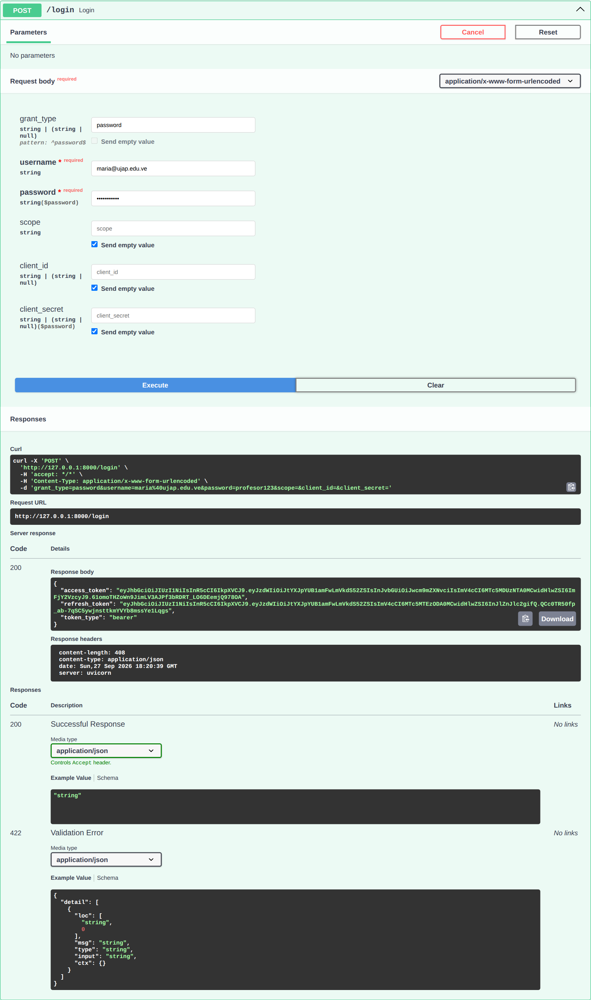
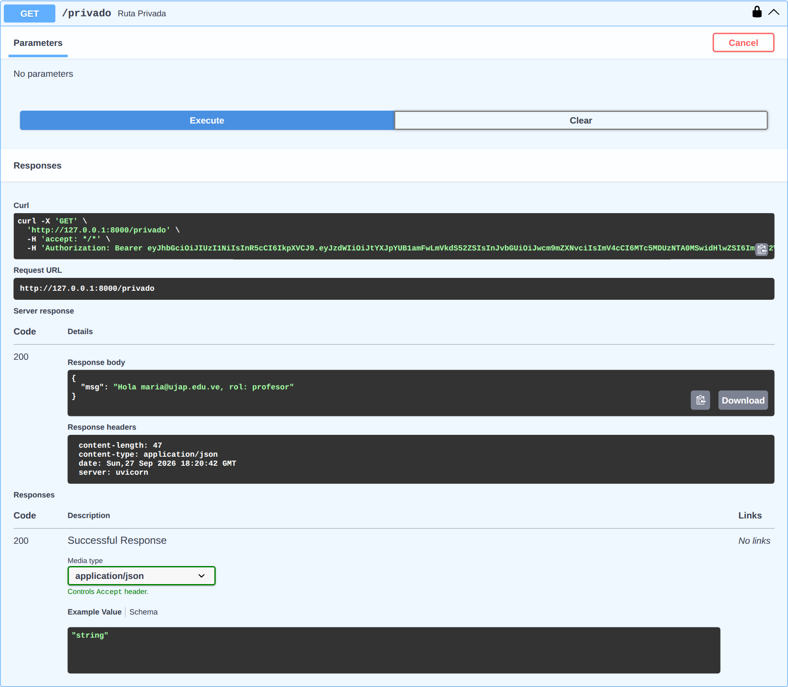

# Autenticación JWT en FastAPI

Actividad de la Semana 10 · LPR07304 Lenguajes de Programación · UJAP 2026-2CR

API construida con FastAPI que autentica usuarios mediante JSON Web Tokens (JWT). Contraseñas con hash bcrypt. Tiene rutas públicas, protegidas y restringidas por rol.

---

## Parte A: Conceptual (40%)

### P1. ¿Qué significa JWT y cuáles son sus tres partes?

**JWT** significa **JSON Web Token** (estándar RFC 7519). Es un token compacto y autocontenido que sirve para transmitir información (*claims*) entre dos partes de forma verificable, porque va **firmado digitalmente**. Tras un login exitoso, el servidor emite el token y el cliente lo envía en cada petición con el encabezado `Authorization: Bearer <token>`. Como toda la información necesaria viaja dentro del token, el servidor no guarda sesiones: la autenticación es **stateless**.

Un JWT tiene tres partes codificadas en Base64URL y separadas por puntos: `header.payload.signature`.

| Parte | Contenido | Ejemplo |
|---|---|---|
| **Header** | Algoritmo de firma y tipo de token | `{"alg": "HS256", "typ": "JWT"}` |
| **Payload** | Los *claims*: datos del usuario y metadatos | `{"sub": "maria@ujap.edu.ve", "role": "profesor", "exp": 1720000000}` |
| **Signature** | Firma calculada sobre el header y el payload con la clave secreta | `HMACSHA256(base64(header) + "." + base64(payload), SECRET_KEY)` |

- `sub` (*subject*): identifica al usuario.
- `role`: claim propio que usamos para los permisos.
- `exp` (*expiration*): fecha de expiración en tiempo Unix. Pasada esa fecha, el token se rechaza.

### P2. ¿Por qué el payload NO es seguro para guardar contraseñas?

Porque el payload solo está **codificado** en Base64URL, **no cifrado**. Codificar no es cifrar: cualquiera que tenga el token puede decodificarlo sin conocer la clave, por ejemplo con `base64 -d` o en jwt.io, y leer todo su contenido.

La firma garantiza la **integridad** (que nadie modificó el token), pero no la **confidencialidad** (que nadie lo lea). Además, el token viaja en cada petición, suele guardarse en el navegador (localStorage, cookies) y puede quedar en logs o proxies. Por eso **nunca** deben ir en el payload contraseñas (ni siquiera con hash), números de tarjeta, CVV, datos médicos ni ningún otro dato sensible. Solo deben ir identificadores y permisos (`sub`, `role`, `exp`).

### P3. ¿Qué sucede si alguien modifica el payload sin conocer el SECRET_KEY?

El token se vuelve **inválido** y el servidor lo rechaza.

La firma es `HMAC-SHA256(header.payload, SECRET_KEY)`. Si un atacante cambia el payload, por ejemplo `"role": "estudiante"` por `"role": "profesor"`, la firma original deja de corresponder al nuevo contenido. Tampoco puede calcular una firma nueva y válida, porque para eso necesita el `SECRET_KEY`.

Al recibir el token, `jwt.decode()` recalcula la firma con el `SECRET_KEY` del servidor y la compara con la que trae el token. Si no coinciden, lanza `JWTError`. Nuestro `get_current_user` captura esa excepción y responde **`401 Unauthorized`** con el mensaje *"Token expirado o inválido"*. Así la firma impide falsificar identidades o escalar privilegios.

> Por eso el `SECRET_KEY` debe ser largo, aleatorio y secreto (en `.env`, nunca en el código ni en Git). Si se filtra, cualquiera puede fabricar tokens válidos.

### P4. Diferencia entre 401 Unauthorized y 403 Forbidden. ¿Cuándo usa cada uno FastAPI?

| | **401 Unauthorized** | **403 Forbidden** |
|---|---|---|
| Significado | **No autenticado**: el servidor no sabe quién eres | **No autorizado**: el servidor sabe quién eres, pero no tienes permiso |
| Pregunta que falla | "¿Quién eres?" | "¿Puedes hacer esto?" |
| Cómo se soluciona | Hacer login y enviar un token válido | Ninguna forma con esa cuenta: hace falta otro usuario o rol |

**En esta API:**

- **401**:
  - `POST /login` con credenciales incorrectas.
  - Rutas protegidas sin token (lo lanza `OAuth2PasswordBearer`: *"Not authenticated"*).
  - Token expirado, manipulado o firmado con otra clave (lo lanza `get_current_user` al capturar `JWTError`).
  - Token sin claim `sub`.

  Va acompañado del encabezado `WWW-Authenticate: Bearer`.
- **403**: `GET /admin` con un token **válido** de un usuario cuyo rol es `estudiante`. La autenticación funciona, pero la regla de autorización (`role != "profesor"`) lo bloquea: *"Solo para profesores"*.

En FastAPI ninguno de los dos es automático más allá de `OAuth2PasswordBearer`. Los lanzamos explícitamente con `raise HTTPException(status_code=401 | 403, detail=...)` según si falló la autenticación o la autorización.

---

## Parte B: Práctica (60%)

### Estructura del proyecto

```
├── main.py            # Endpoints
├── auth.py            # JWT + bcrypt + get_current_user
├── .env               # SECRET_KEY (no se sube: está en .gitignore)
├── .env.example       # Plantilla del .env sin secretos
├── .gitignore
├── requirements.txt
├── capturas/          # Capturas de Swagger UI
└── README.md
```

### Instalación y ejecución

```bash
python3 -m venv venv
source venv/bin/activate            # Windows: venv\Scripts\activate
pip install -r requirements.txt

cp .env.example .env
python -c "import secrets; print(secrets.token_hex(32))"   # pegar el resultado en SECRET_KEY del .env

uvicorn main:app --reload
```

Swagger UI: <http://127.0.0.1:8000/docs>

### Usuarios de prueba

| Usuario (username) | Contraseña | Rol |
|---|---|---|
| `maria@ujap.edu.ve` | `profesor123` | profesor |
| `estudiante@ujap.edu.ve` | `estudiante123` | estudiante |

### Endpoints

| Método | Ruta | Protección | Respuestas |
|---|---|---|---|
| `POST` | `/login` | Pública (form-data `username` / `password`) | 200 con tokens · 401 credenciales incorrectas |
| `POST` | `/refresh-token` | Requiere refresh token (JSON) | 200 con tokens nuevos · 401 inválido/expirado |
| `GET` | `/publico` | Ninguna | 200 |
| `GET` | `/privado` | Access token válido | 200 · 401 |
| `GET` | `/admin` | Access token válido + rol `profesor` | 200 · 401 · 403 |

### Cambios respecto al código de las diapositivas

El código de las diapositivas 5 y 6 no funcionaba tal cual. Estos son los cambios que aplicamos:

1. **Imports faltantes en `auth.py`.** Usaba `Depends`, `HTTPException` y `oauth2_scheme` sin importarlos.
2. **Importación circular.** `oauth2_scheme` estaba en `main.py`, pero `get_current_user` (en `auth.py`) lo necesita. Se movió a `auth.py`.
3. **Hashes reales.** Los hashes de `fake_users` eran de ejemplo (`"$2b$12$..."`), así que ningún login funcionaba. Ahora se generan al arrancar con `hash_password()`.
4. **Lectura del `.env`.** `os.environ.get` no lee el archivo `.env`. Se agregó `python-dotenv` con `load_dotenv()`.
5. **`datetime.utcnow()` está obsoleto** en Python 3.12. Se reemplazó por `datetime.now(timezone.utc)`.
6. **Compatibilidad de bcrypt.** passlib 1.7.4 falla con bcrypt ≥ 4.1, por eso `requirements.txt` fija `bcrypt==4.0.1`.
7. **Encabezado en los 401.** Todas las respuestas 401 llevan `WWW-Authenticate: Bearer`, como indica el estándar.

### Extra: `/refresh-token`

El access token dura solo **30 minutos**, que es poco a propósito: si alguien lo roba, le sirve poco tiempo. Para no obligar al usuario a escribir su contraseña cada 30 minutos, `/login` también entrega un **refresh token** que dura **7 días**.

```
POST /login           → { access_token, refresh_token, token_type }
   ... pasan 30 min, el access_token expira (401) ...
POST /refresh-token   { "refresh_token": "<token>" }
                      → { access_token (nuevo), refresh_token (nuevo), token_type }
```

Así se implementa:

- **Claim `type`.** Cada token lleva `"type": "access"` o `"type": "refresh"`, y cada uno solo sirve para lo suyo:
  - Si se usa un refresh token en `/privado`, responde 401.
  - Si se envía un access token a `/refresh-token`, responde 401.

  Sin esta separación, un refresh token robado daría 7 días de acceso directo a la API.
- **Payload mínimo del refresh token.** Solo lleva `sub`, sin el rol. Al renovar, el rol se vuelve a leer de la base de datos: si a un usuario le cambian el rol, su próximo access token ya lo refleja.
- **Usuarios eliminados.** Si el usuario ya no existe en la base de datos, `/refresh-token` responde 401.
- **Rotación.** Cada renovación entrega también un refresh token nuevo.

Ejemplo con `curl`:

```bash
curl -X POST http://127.0.0.1:8000/refresh-token \
     -H "Content-Type: application/json" \
     -d '{"refresh_token": "<refresh_token del login>"}'
```

### Pruebas realizadas

| # | Caso | Resultado |
|---|---|---|
| 1 | `GET /publico` sin token | 200 |
| 2 | `POST /login` con contraseña incorrecta | 401 *Credenciales incorrectas* |
| 3 | `POST /login` como profesor | 200 con `access_token` y `refresh_token` |
| 4 | `GET /privado` con token de profesor | 200 *Hola maria@ujap.edu.ve, rol: profesor* |
| 5 | `GET /admin` con token de profesor | 200 *Panel de administración* |
| 6 | `GET /admin` con token de estudiante | **403** *Solo para profesores* |
| 7 | `GET /privado` sin token | **401** *Not authenticated* |
| 8 | Payload modificado (`role` → `profesor`) sin re-firmar | **401** *Token expirado o inválido* (P3) |
| 9 | Token firmado con otra clave | 401 |
| 10 | Token expirado | 401 |
| 11 | `POST /refresh-token` con refresh token válido | 200, y el nuevo access token funciona en `/privado` |
| 12 | `POST /refresh-token` con un access token | 401 *Se esperaba un token de tipo 'refresh'* |
| 13 | `GET /privado` con un refresh token | 401 *Se esperaba un token de tipo 'access'* |
| 14 | `POST /login` enviando JSON en lugar de form-data | 422 (ver diapositiva 10) |

### Capturas de Swagger UI

#### ① `POST /login` → 200 con token



#### ② `GET /privado` → 200 (autenticado)



#### ③ `GET /admin` → 403 (rol estudiante)


